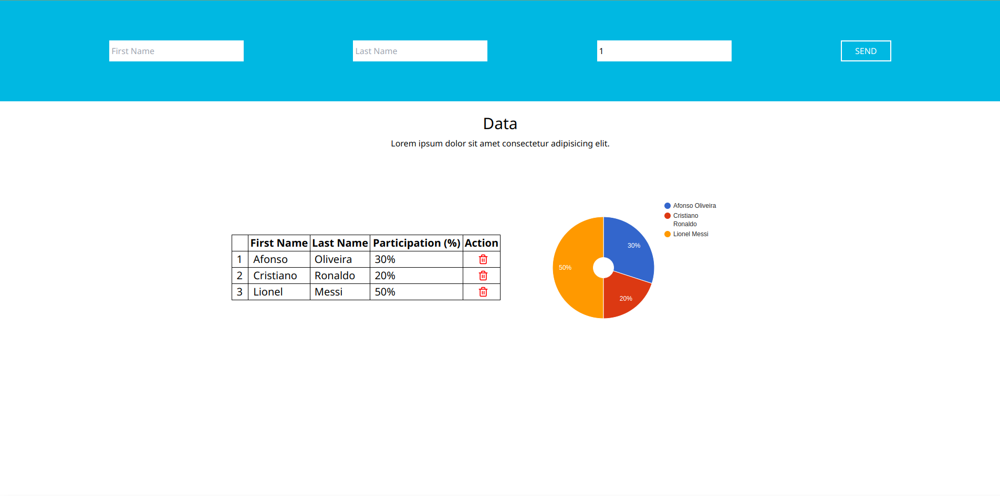

# Cotabox Web
## Projeto para o cadastro da participação de usuários

# 💻 Sobre
Este projeto foi concebido como o desafio técnico da empresa Cotabox. Ele tem como objetivo o cadastro da participação de usuários em determinada tarefa, bem como mostrar esses dados em uma tabela e gráfico. 

# 🎨 Layout
### Web



# Instalação
### Pré requisitos
Certifique-se de ter o [Node](https://nodejs.org/en/) e o [Git](https://git-scm.com) instalados, além de um gerenciador
de pacotes como o [Yarn](https://yarnpkg.com/) ou o [NPM](https://www.npmjs.com/).

### Configuração
```bash
# Clone o repositório
$ git clone https://github.com/afonsomateus21/cotabox-web.git ou
$ git clone git@github.com:afonsomateus21/cotabox-web.git se utilizar SSH

# Instale as dependências
$ npm install ou yarn 

#Crie um arquivo .env na raiz do projeto com a seguinte variável:
VITE_API_URI_DEVELOPMENT_MODE=http://localhost:4000/

```

### 🎨 Execução
```bash
# Execute a aplicação em modo de desenvolvimento
$ npm run dev ou yarn dev

# O aplicação ficará disponível na porta:5173 - acesse <http://localhost:5173>
```

# Deploy
O deploy da aplicação se encontra no seguinte [Link](https://cotabox-web.vercel.app/)

# 🛠 Tecnologias
As seguintes tecnologias foram utilizadas na construção do projeto:
- [TypeScript](https://www.typescriptlang.org/)
- [React](https://react.dev/)
- [Vite](https://vitejs.dev/)
- [Apollo Client](https://www.apollographql.com/docs/react/)
- [Vercel](https://vercel.com/)

# Autor
Afonso Mateus<br/>
<a href="https://www.linkedin.com/in/afonso-mateus-3a8522118/"></a>


# Licença
Este projeto está sob a licença [MIT](https://github.com/afonsomateus21/cotabox-web/blob/main/LICENSE)

Feito com ❤️ por Afonso Mateus 👋 [Entre em contato!](https://www.linkedin.com/in/afonso-mateus-3a8522118/)